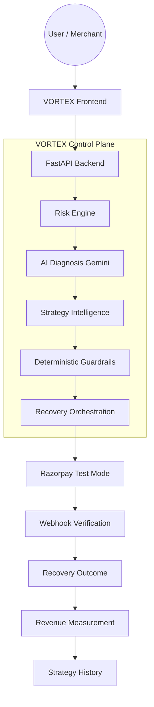

# VORTEX

## AI-Powered Revenue Recovery & Decision Intelligence

VORTEX is an AI-assisted revenue recovery control plane designed for the Razorpay AI Buildathon (Track 03). It addresses the critical challenge of revenue leakage caused by failed payments, abandoned checkouts, and overdue invoices.

Failed payments are a major source of lost revenue, but blindly retrying payments can be ineffective, frustrate customers, and violate payment gateway safety limits. VORTEX solves this by introducing context-aware, bounded intervention. 

VORTEX combines deterministic risk assessment, Google Gemini AI diagnosis, historical strategy intelligence, and strict deterministic guardrails to securely execute Razorpay Test Mode recovery actions, verifying outcomes via webhooks to measure recovered revenue mathematically.

---

> **AI recommends. Deterministic policy decides. Verified payment events determine the outcome.**

- **AI Diagnosis**: Gemini provides root cause analysis and contextual recommendations.
- **Deterministic Policy**: Strict backend logic enforces financial rules, limits, and executes bounded actions.
- **Verified Outcomes**: External Razorpay webhooks establish cryptographic evidence of successful recovery.

---

## The Problem

Merchants face significant revenue leakage from failed payments. Attempting to recover this revenue introduces operational and financial risks:
- Repeated blind retries can trigger spam limits or cardholder friction.
- Recovery interventions lack context (e.g., retrying an "Insufficient Funds" error immediately vs. waiting).
- Measuring the exact ROI of recovery efforts is difficult without verified external payment evidence.
- Fully autonomous AI agents executing financial payments represent an unacceptable regulatory and safety risk.

---

## What VORTEX Does

VORTEX operates on a strictly governed lifecycle:

| Stage | What VORTEX Does |
|---|---|
| **Detect** | Detects revenue events and assesses risk deterministically |
| **Diagnose** | Analyzes likely failure causes using Google Gemini AI |
| **Decide** | Selects/recommends an optimal recovery strategy based on historical success |
| **Guard** | Applies strict deterministic policies to block unsafe or excessive actions |
| **Recover** | Executes an approved recovery action (e.g., creates Razorpay Order) |
| **Verify** | Verifies payment outcome using cryptographically signed Razorpay webhooks |
| **Measure** | Measures recovered revenue against total risk exposure |
| **Learn** | Uses historical verified outcomes for future strategy intelligence |

---

## End-to-End Architecture



VORTEX structurally isolates intelligence from execution. Read the full architecture design:
- [**Architecture Specification**](docs/ARCHITECTURE.md)

---

## Why the Architecture Is Safe

AI cannot bypass deterministic safety controls or directly authorize financial execution.

| Component | Role | Authority |
|---|---|---|
| **AI Diagnosis** | Failure analysis and recommendation | *Advisory* |
| **Risk Engine** | Risk severity classification | *Deterministic* |
| **Strategy Intelligence**| Strategy evaluation/recommendation | *Bounded* |
| **Guardrails** | Action authorization (e.g., retry limits) | *Deterministic* |
| **Recovery Orchestrator**| Executes allowed actions | *Controlled* |
| **Razorpay** | Payment processing (Test Mode) | *External Truth* |
| **Webhook Verification** | Payment evidence validation | *Verification* |
| **Revenue Evaluation** | Outcome measurement | *Deterministic* |

---

## What the Buildathon Demo Proves

| Capability | Evaluator Evidence |
|---|---|
| **Risk Detection** | Cases are created deterministically based on value and recurrence. |
| **AI Diagnosis** | Gemini generates contextual failure explanations (e.g., "Insufficient Funds"). |
| **Deterministic Decisioning** | Baselines fallback cleanly when historical data is insufficient. |
| **Guardrails** | The system explicitly `BLOCKS` actions exceeding the 3-retry limit. |
| **Bounded Recovery** | Authorized actions execute via Razorpay Test Mode Orders. |
| **Test Mode Checkout** | The frontend smoothly handles the Razorpay UI integration. |
| **Webhook Verification** | The backend verifies `x-razorpay-signature` and updates case states asynchronously. |
| **Verified Recovery** | Cases transition to `RECOVERED` only upon successful external webhook receipt. |
| **Revenue Measurement** | The Command Center accurately attributes actual recovered revenue. |
| **Strategy Performance** | Success rates update dynamically based on verified outcomes. |
| **Event-Type Segmentation**| Strategies are independently tracked for different failure types (e.g., payments vs. invoices). |
| **Auditability** | A clear, event-driven timeline traces every action from creation to recovery. |
| **Recovery Simulation** | Synthetically models expected revenue without conflating with real outcomes. |
| **What-If Analysis** | Allows real-time policy modeling without altering production execution bounds. |

---

## Product Modules

VORTEX is divided into several purpose-built evaluator modules:

### Merchant Command Center
Provides an operational overview of revenue risk, recovery rates, and top-performing strategies.

### Recovery Cases
The governed pipeline for viewing failed payments, AI diagnoses, recommended strategies, guardrail evaluations, and action histories.

### Decision Intelligence
Surfaces underlying AI/contextual decision metrics driving specific case recommendations.

### Strategy Performance
Tracks historical strategy attempts, success rates, recovered revenue, and event-type segmentation.

### Recovery Simulation
Evaluates projected recovery outcomes (Organic vs. Basic Retry vs. Sentinel Optimized) mathematically, without executing real Razorpay transactions.

### Policy What-If Lab
Allows merchants to evaluate the potential financial impact of changing safety policies (e.g., altering retry limits).

### Activity / Audit
Provides granular operational visibility into recovery actions, webhook receipts, and state transitions.

---

## Technical Documentation

To keep this README focused, detailed engineering documentation is modularized below:

### AI Intelligence
Explains how Gemini provides contextual reasoning, diagnosis, and explainability without possessing financial execution authority. 
- [**AI Diagnosis**](docs/AI_DIAGNOSIS.md)

### Recovery Engine
Explains the state machine converting revenue-risk events into bounded, executed, and verified outcomes.
- [**Recovery Engine**](docs/RECOVERY_ENGINE.md)

### Guardrails
Documents the strict deterministic policies (retry limits, case statuses) that enforce financial safety.
- [**Guardrails**](docs/GUARDRAILS.md)

### Razorpay Integration & Verification
Details how Razorpay Test Mode handles external execution and how the `/api/v1/webhooks/razorpay` endpoint establishes cryptographic payment evidence.
- [**Razorpay Integration**](docs/RAZORPAY_INTEGRATION.md)
- [**Webhook Verification**](docs/WEBHOOK_VERIFICATION.md)

### Revenue Evaluation
Defines exactly what VORTEX measures, enforcing the rule that *Attempted recovery ≠ verified recovery*.
- [**Revenue Evaluation**](docs/REVENUE_EVALUATION.md)

### Strategy Intelligence & Learning
Explains how VORTEX learns from verified historical outcomes, applying statistical analytics rather than autonomous model retraining.
- [**Strategy Learning**](docs/STRATEGY_LEARNING.md)

---

## Simulation & What-If Analysis

- **Recovery Simulation**: Generates synthetic/projected recovery evaluations. Simulation results are **not** real Razorpay transactions and are not counted as verified recovered revenue.
- **Policy What-If**: Safely projects the outcome of hypothetical policy adjustments (e.g., expanding retry limits) against existing open cases without modifying the actual guardrail engine.

## Auditability
VORTEX logs every relevant recovery action, guardrail validation, and webhook receipt. The audit timeline clearly associates Razorpay `order_id` and `payment_id` values with `RecoveryCase` and `RecoveryAction` states, ensuring evaluator visibility from initial risk to final verification.

---

## Technology Stack

| Layer | Technology |
|---|---|
| **Frontend** | React, TypeScript, Vite, Tailwind CSS |
| **Backend** | Python, FastAPI, Pydantic |
| **AI** | Google Gemini API (`gemini-2.5-flash` / `gemini-1.5-flash`) |
| **Payments** | Razorpay SDK (Test Mode) |
| **Events** | Razorpay Webhooks (HMAC SHA-256) |
| **State** | In-Memory Volatile Data Store (`store.py`) |

---

## Project Structure

```text
revenue-sentinel/
├── backend/
│   ├── app/
│   │   ├── api/          # FastAPI Routes (Intelligence, Cases, Webhooks)
│   │   ├── models/       # Pydantic Domain Models
│   │   ├── services/     # Risk, Guardrails, Orchestration, AI, Razorpay
│   │   ├── main.py       # FastAPI Entrypoint
│   │   └── store.py      # In-Memory State
├── frontend/
│   ├── src/
│   │   ├── components/   # React Components (UI, Metrics, Recovery)
│   │   ├── pages/        # Command Center, Cases, Strategy, Simulation
│   │   └── App.tsx       # Routing
├── docs/                 # Detailed Technical Architecture Docs
└── README.md
```

## Evaluator Guide & Setup

To reproduce the workflow, view the evaluator demonstration guide and deployment instructions:
- [**Demo Runbook**](docs/DEMO_RUNBOOK.md)
- [**Deployment Guide**](docs/DEPLOYMENT.md)
- [**Buildathon Review**](docs/BUILDATHON_REVIEW.md)
