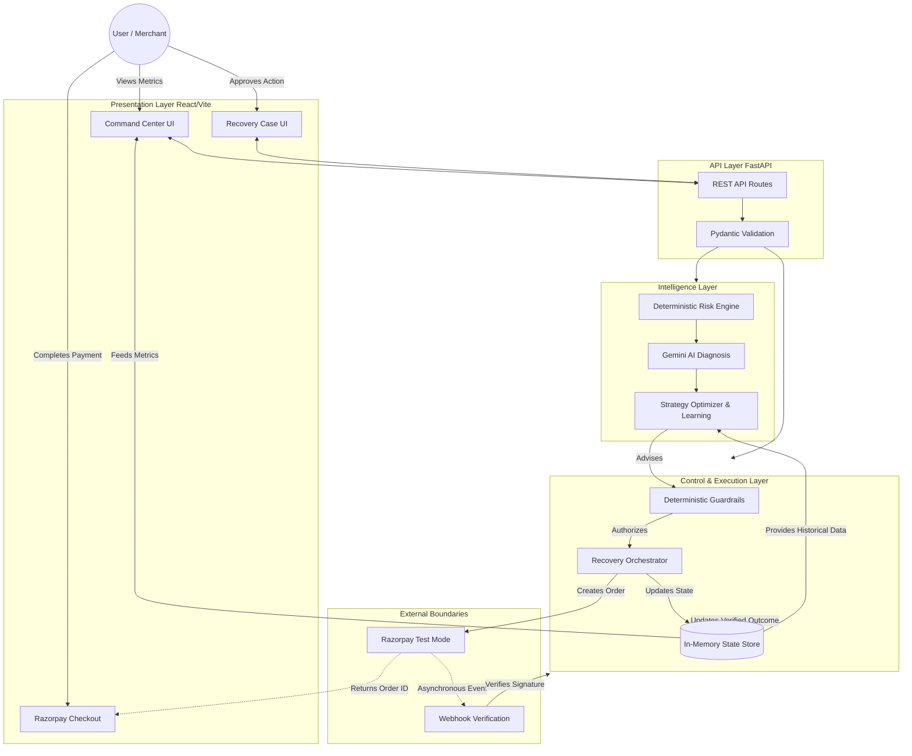
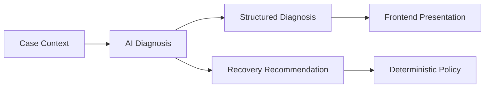

# VORTEX Architecture

VORTEX is an AI-assisted revenue recovery and decision-intelligence control plane that detects revenue risk, diagnoses likely failure causes, recommends bounded recovery strategies, enforces deterministic policies, executes approved recovery actions through Razorpay Test Mode, verifies payment outcomes, measures recovered revenue, and uses historical outcomes to inform future strategy decisions.

## 1. Architecture Principles

VORTEX is built around strict separation of responsibilities to ensure financial safety:

- **AI provides intelligence**: Gemini diagnoses failures, reasons contextually, and recommends strategies.
- **Deterministic systems provide control**: Strict backend logic controls financial amounts, risk rules, retry limits, action authorization, and recovery execution.
- **External payment evidence provides truth**: Cryptographically verified Razorpay webhook events are the sole source of truth for payment completion.

**AI recommends. Deterministic policy decides. Verified payment events determine the outcome.**

## 2. High-Level Architecture

## 3. System Layers

### 3.1 Presentation Layer
The frontend is a React + TypeScript application (built with Vite) that provides the merchant interface. It includes:
- **Command Center**: High-level revenue and recovery metrics.
- **Decision Intelligence**: AI diagnosis and strategy insights.
- **Recovery Simulation & What-If**: Non-destructive policy exploration.
- **Activity/Audit**: Timeline of cases and actions.
- **Razorpay Checkout**: Seamless frontend integration for Test Mode payment recovery.

### 3.2 API Layer
The FastAPI backend acts as the gateway to the system. It handles:
- RESTful routing (e.g., `/api/v1/cases`, `/api/v1/intelligence`, `/api/v1/webhooks`).
- Request validation (Pydantic models).
- Domain service invocation.
- External webhook ingestion.

### 3.3 Domain and State Layer
VORTEX operates on core domain models (`domain.py`) such as `RevenueEvent`, `RecoveryCase`, `RecoveryAction`, and `AuditLog`.
**Current Limitation**: The architecture currently utilizes a volatile, in-memory state layer (`app/store.py`). Persistence across server restarts is not yet implemented.

## 4. Core Decision Pipeline

The central workflow of VORTEX is a structured, bounded decision pipeline:

1. **Revenue Event**: Ingestion of a failed payment event.
2. **Risk Assessment**: Deterministic severity classification based on value and history.
3. **Recovery Case**: State machine tracking the recovery opportunity.
4. **AI Diagnosis**: Contextual analysis of the failure.
5. **Strategy Selection**: Historical outcome-based recommendation.
6. **Deterministic Guardrails**: Strict policy authorization.
7. **Recovery Action**: Authorized action transitions to execution.
8. **Razorpay Test Mode**: Order creation and Checkout flow.
9. **Payment Verification**: Webhook signature verification.
10. **Recovery Confirmation**: Action marked executed, Case marked recovered.
11. **Revenue Measurement**: Recovered value attributed to metrics.
12. **Strategy History**: Outcome feeds future strategy learning.

## 5. Risk Assessment Architecture

The Risk Engine (`risk_engine.py`) deterministically evaluates financial exposure before AI intervention. It uses structured signals (amount, event type, retry count) to assign severities:
- `CRITICAL`: (e.g., ≥ ₹50,000 or severely overdue high-value revenue)
- `HIGH`: (e.g., ≥ ₹10,000 or multiple failures)
- `MEDIUM`: (e.g., standard failure)
- `LOW`: (e.g., < ₹100 first failure)

Deterministic risk rules ensure that high-value exposure is strictly controlled without relying on probabilistic AI evaluation.

## 6. AI Intelligence Layer

The AI layer (`intelligence.py`) uses Google Gemini to provide qualitative reasoning.

**What AI Provides**: Root cause analysis, explainability, and context-aware recommendations.
**What AI Cannot Control**: Execution authority, retry limits, case state manipulation, or financial amounts. 
*(If Gemini is rate-limited or unavailable, the system safely falls back to a deterministic baseline).*

## 7. Deterministic Policy and Guardrails

The guardrail service acts as the strict trust boundary. Any recommended recovery action (whether from AI or statistical learning) must be explicitly authorized (`ALLOWED`) or rejected (`BLOCKED`) by policy constraints (e.g., maximum of 3 retries, action cooldowns, terminal case states). See [Guardrails Documentation](GUARDRAILS.md).

## 8. Recovery Orchestration

The orchestrator (`recovery_orchestrator.py`) handles execution. If an action is `ALLOWED`, the orchestrator initiates the external operation (e.g., creating a Razorpay order). It tracks the action state (`PROPOSED` → `ALLOWED` → `EXECUTED`) and associates it precisely with the overarching recovery case.

## 9. Razorpay Integration Architecture

VORTEX executes actual financial recovery via Razorpay Test Mode.
- The backend securely creates a Razorpay Order.
- The frontend securely launches Checkout using the order ID.
- Payment outcome is strictly determined by external Razorpay events.
See [Razorpay Integration](RAZORPAY_INTEGRATION.md).

## 10. Webhook and Verification Boundary

The webhook layer (`/api/v1/webhooks/razorpay`) enforces the rule that **Payment Attempt ≠ Verified Recovery**.
- Order creation or Checkout launch does not prove recovery.
- Only a cryptographically verified Razorpay event (e.g., `payment.captured`) can confirm payment completion.
- Webhooks are securely mapped back to the VORTEX order and action IDs to prevent mismatched recovery.
See [Webhook Verification](WEBHOOK_VERIFICATION.md).

## 11. Revenue Measurement Architecture

Verified outcomes feed the measurement engine. Revenue is categorized into metrics like Total Revenue at Risk, Recovered Revenue, and Recovery Rate. Metrics are mathematically derived exclusively from actual verified states. See [Revenue Evaluation](REVENUE_EVALUATION.md).

## 12. Strategy Intelligence and Learning Loop

VORTEX learns from verified outcomes. The strategy optimizer (`strategy_optimizer.py`) segments past outcomes by event type to calculate Expected Net Recovery (Success Rate vs. Intervention Cost). If historical data meets minimum evidence thresholds (N≥5), the statistical outcome overrides baseline recommendations.
**VORTEX learns from verified outcomes; it does not give learned behavior authority to bypass safety controls.** (No autonomous model retraining is implemented). See [Strategy Learning](STRATEGY_LEARNING.md).

## 13. Recovery Simulation and What-If Architecture

VORTEX supports non-destructive analysis:
- **Recovery Simulation**: Evaluates projected outcomes (Organic vs. Basic Retry vs. Sentinel Optimized) using statistical estimates without executing real transactions. Simulated revenue is strictly segregated from actual verified revenue.
- **What-If Analysis**: Allows operators to safely explore the financial impact of policy changes (e.g., altering max retry limits) against existing open cases.

## 14. Audit and Observability

VORTEX provides a transparent timeline. Every state transition generates an audit log detailing the actor (System/Merchant), the action (`CASE_CREATED`, `ACTION_PROPOSED`, `WEBHOOK_RECEIVED`), timestamps, and contextual data (e.g., order IDs). This provides robust evaluator visibility.

## 15. End-to-End Architecture Example

1. A failed payment (`PAYMENT_FAILED`) enters VORTEX.
2. The Risk Engine assesses it as `MEDIUM`.
3. An `OPEN` recovery case is created.
4. Gemini AI diagnoses "Insufficient Funds."
5. Strategy Intelligence recommends `DELAYED_RETRY` based on historical success.
6. Guardrails authorize the retry (0 prior attempts).
7. The Orchestrator creates a Razorpay Test Mode order.
8. The customer completes Checkout.
9. Razorpay sends a `payment.captured` webhook.
10. VORTEX verifies the HMAC SHA-256 webhook signature.
11. The action becomes `EXECUTED`, the case becomes `RECOVERED`.
12. The recovered revenue is measured in the Command Center.
13. The outcome increments historical success metrics for `DELAYED_RETRY`.

## 16. Trust Boundary

| Layer | Responsibility | Authority |
|------|----------------|-----------|
| AI | Diagnosis and recommendation | Advisory |
| Risk Engine | Deterministic risk classification | Deterministic |
| Strategy Logic | Strategy evaluation/recommendation | Bounded |
| Guardrails | Action authorization | Deterministic |
| Recovery Orchestrator | Execute allowed action | Controlled |
| Razorpay | External payment processing | External source |
| Webhook Verification | Validate payment evidence | Verification |
| Revenue Metrics | Measure outcome | Deterministic |

**No AI component directly controls financial execution.**

## 17. Deployment Architecture

- **Frontend**: Hosted on Vercel (React/Vite).
- **Backend**: Hosted on Render (FastAPI/Uvicorn).
- **External Dependencies**: Google Gemini API, Razorpay Test Mode API.
The frontend communicates directly with the backend REST API, while the backend securely mediates all external provider communication. See [Deployment Guide](DEPLOYMENT.md).

## 18. Security and Safety Considerations

- All secrets (Gemini API keys, Razorpay secrets) remain securely server-side.
- The frontend initiates Checkout using safe, scoped order parameters.
- Webhook signature validation (`x-razorpay-signature`) protects the state transition boundary.
- Deterministic guardrails enforce safety boundaries regardless of AI output.

## 19. Current Scope and Limitations

- **Test Mode Only**: Razorpay integration is strictly demonstrated using Test Mode.
- **Volatile State**: Data persistence relies on an in-memory store; data does not survive server restarts.
- **AI Dependence**: Diagnostic functionality depends on external Gemini API availability.
- **Simulation ≠ Truth**: Simulated outcomes are mathematical projections, not actual financial recoveries.
- **Data Reliance**: Strategy intelligence is highly dependent on accumulating historical evidence over time.

## 20. Buildathon Alignment

VORTEX aligns directly with Razorpay Track 03:
- **Detect revenue at risk**: Handled by the deterministic Risk Engine and case creation.
- **Determine intervention**: Handled by AI Diagnosis and Strategy Intelligence.
- **Execute bounded recovery**: Governed by Guardrails and Recovery Orchestration.
- **Demonstrate measured money recovered**: Delivered through Razorpay Test Mode, Webhook Verification, and Revenue Metrics.
- **Enforce stopping rules**: Explicitly controlled by the Guardrail trust boundary.
- **Provide auditability**: Maintained via a comprehensive, event-driven timeline.
- **Learn from outcomes**: Realized through the statistical Strategy Learning loop.

## 21. Architecture Summary

**VORTEX is designed around a deliberate separation of intelligence, control, execution, and verification: AI provides contextual reasoning, deterministic systems control financial actions, Razorpay provides external payment evidence, and verified outcomes feed measurable revenue and strategy intelligence.**