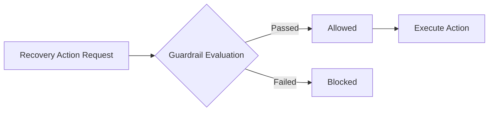

# VORTEX Guardrails

VORTEX explicitly separates AI intelligence from deterministic execution control. All financial recovery actions—whether recommended by an AI or initiated via a manual override—must pass strict deterministic policy validation before they are executed. 

## 1. Safety Principle

**AI recommends. Deterministic policy decides.**

AI output cannot directly authorize or execute a financial recovery action. The system treats an AI diagnosis as an advisory input, while the deterministic guardrail layer acts as the absolute execution authority.

## 2. Guardrail Enforcement

Every requested recovery action is evaluated by the deterministic guardrail layer (`backend/app/services/guardrails.py`) prior to execution. The engine evaluates:

- The current status of the recovery case
- The requested recovery action type
- The current retry/attempt count
- Time elapsed since the last attempted action (cooldowns)
- Merchant-level safety configurations

## 3. Implemented Guardrails

The following deterministic safety rules are currently implemented in VORTEX:

### Recovered Cases
- A case in the `RECOVERED` state cannot receive further recovery actions. All actions are blocked.

### Stopped Cases
- A case in the `STOPPED` state blocks normal recovery actions (e.g., `RETRY_PAYMENT`, `SEND_REMINDER`).
- `STOP_RECOVERY` and `ESCALATE_TO_HUMAN` remain permitted to allow final status adjustments or manual review.

### Stop Recovery
- `STOP_RECOVERY` is always permitted as a safety override control (unless the case is already `RECOVERED`).

### Human Escalation
- `ESCALATE_TO_HUMAN` is always permitted to ensure safety review (unless the case is already `RECOVERED`).

### Retry Limit
- `RETRY_PAYMENT` is bounded to a maximum of 3 attempts by default (configurable per merchant).
- A mandatory minimum cooldown period (default 24 hours) is enforced between consecutive `RETRY_PAYMENT` attempts.

### Merchant Configuration
- `recovery_enabled`: Global kill switch to disable all recovery actions.
- `supported_actions`: Execution is blocked if the requested action is not explicitly supported by the merchant configuration.

## 4. Decision Flow

## 5. AI and Safety Boundary

- AI can diagnose likely causes of payment failure.
- AI can recommend an optimal recovery strategy or action.
- AI **does not** control retry limits or cooldown periods.
- AI **does not** override case-state restrictions (e.g., acting on closed cases).
- AI **does not** bypass deterministic guardrails.
- Financial execution remains strictly controlled by deterministic application logic.

## 6. Auditability

The audit lifecycle maintains a complete history of guardrail evaluations. When an action is allowed, it is recorded in the case timeline as authorized and executed. If an action fails policy evaluation, it is recorded with the status `BLOCKED` along with the specific rejection reason (e.g., "Maximum retry attempts reached"). This ensures that safety boundary enforcement is fully traceable.

## 7. Examples

**Allowed Example:**
A failed payment receives an AI recommendation to retry. The guardrail checks the case status (`ACTIVE`) and retry count (0 attempts). Because the limit is not reached and no cooldown is active, the action is marked **Allowed** and recovery proceeds.

**Blocked Example:**
A fourth retry request is initiated (either via an aggressive strategy or manual override). The guardrail evaluates the action, detects that the maximum retry limit (3) has already been reached, and immediately **Blocks** the action, preventing further execution spam.

## 8. Safety Guarantees and Limitations

**What Guardrails Enforce:**
- Deterministic limits on retries, case states, timeouts, and execution authority.

**What Remains Outside Scope:**
- **External Payment Systems:** Guardrails do not guarantee external Razorpay gateway uptime or approval rates.
- **AI Diagnosis Uncertainty:** Guardrails prevent unsafe action execution but do not correct an inaccurate AI text diagnosis.
- **Test Mode Limitations:** VORTEX is demonstrated using Razorpay Test Mode. These guardrails enforce safe execution within the test environment but are not processing real-money production transactions.

## 9. Related Documentation

- [AI Development Rules](AI_DEVELOPMENT_RULES.md)
- [AI Diagnosis Architecture](AI_DIAGNOSIS.md)
- [Recovery Engine](RECOVERY_ENGINE.md)
- [Razorpay Integration](RAZORPAY_INTEGRATION.md)
- [Webhook Verification](WEBHOOK_VERIFICATION.md)
- [Architecture Overview](ARCHITECTURE.md)