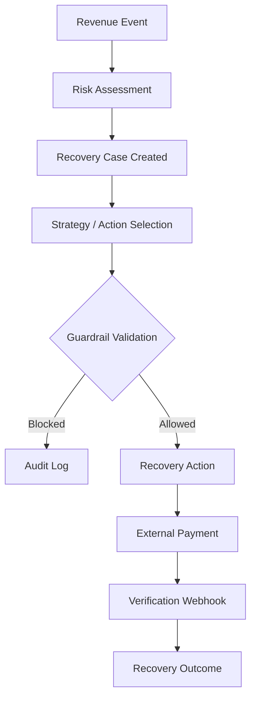

# VORTEX Recovery Engine

The VORTEX Recovery Engine is the controlled decision and execution layer situated between revenue-risk detection and verified outcome. It governs the entire lifecycle of a failed payment, ensuring that all interventions are strategic, safe, and verifiable.

**Detect → Decide → Guard → Recover → Verify → Measure**

## 1. Purpose

The engine is responsible for:
- Processing incoming failed revenue events.
- Deterministically assessing baseline risk levels.
- Orchestrating recovery cases.
- Recommending optimal recovery actions based on historical intelligence.
- Enforcing strict deterministic guardrails to prevent unsafe execution.
- Executing bounded recovery actions (e.g., Razorpay orders).
- Processing payment webhooks to verify outcomes.
- Measuring and attributing recovered revenue.

## 2. Recovery Lifecycle

## 3. Risk Assessment

When a `RevenueEvent` indicates a failure (e.g., `PAYMENT_FAILED`, `INVOICE_OVERDUE`), the engine deterministically assesses the risk level (`risk_engine.py`) using structured signals:

- **CRITICAL**: Very high-value failure (≥ ₹50,000) OR severely overdue high-value revenue (≥ ₹10,000).
- **HIGH**: High-value failure (≥ ₹10,000) OR repeated payment failures (≥ 3 attempts).
- **MEDIUM**: Secondary payment failure OR default standard failure.
- **LOW**: Very small amount (< ₹100) on the first failure.

These thresholds provide a baseline urgency metric separate from the AI diagnosis.

## 4. Recovery Cases

A failed payment opportunity is managed as a **Recovery Case**. A case acts as the state machine holding all attempted actions, guardrail evaluations, and outcomes.

Implemented case states (`RecoveryCaseStatus`):
- `OPEN`: Newly created case awaiting evaluation.
- `IN_PROGRESS`: Active case with executed or proposed actions.
- `RECOVERED`: Terminal success state; revenue is verified as recovered.
- `STOPPED`: Terminal failure/halt state; no further recovery permitted.
- `ESCALATED`: Terminal manual state; requires human merchant intervention.

## 5. Recovery Actions

Interventions are managed as discrete, auditable **Recovery Actions** (`RecoveryActionType`). Implemented types include:

- `RETRY_PAYMENT`
- `SEND_PAYMENT_LINK`
- `SEND_REMINDER`
- `OFFER_ALTERNATIVE_METHOD`
- `ESCALATE_TO_HUMAN`
- `STOP_RECOVERY`

Every action is associated with a case and must transition through states such as `PROPOSED`, `ALLOWED` (or `BLOCKED`), and `EXECUTED`.

## 6. Strategy Selection

VORTEX selects strategies using Decision Intelligence (`strategy_optimizer.py`). The engine segments historical outcomes by event type and failure reason to calculate statistical success rates and expected net recovery. 

- Strategy learning is based strictly on **verified historical outcomes** (success vs. failure rates for given actions).
- If insufficient historical data exists, it defaults to deterministic baselines.
- The system **does not** autonomously train or fine-tune an AI/ML model; it uses statistical analytics on recorded data to recommend the optimal path.

## 7. Guardrail Boundary

All selected or recommended recovery actions must pass deterministic policy validation before execution.

**AI may recommend. Deterministic policy controls execution.**

For example, an action that exceeds the maximum retry count is strictly `BLOCKED` by the engine regardless of the AI or Strategy Optimizer's confidence. For detailed rules, see [Guardrails Documentation](GUARDRAILS.md).

## 8. Execution

When an action (e.g., `RETRY_PAYMENT`) is marked `ALLOWED`, the orchestration flow moves to execution:
1. Action authorization is recorded.
2. A Razorpay Test Mode Order is created deterministically by the backend.
3. The frontend is provided with safe order parameters to launch the Checkout UI.
4. The user completes the payment flow.

*(For full execution details, see [Razorpay Integration](RAZORPAY_INTEGRATION.md)).*

## 9. Verification and Recovery Confirmation

Initiating a Checkout or creating a Razorpay order **does not** mean revenue was recovered.

Recovery is exclusively counted when the payment verification flow (via `/verify-payment` signature check or `payment.captured` webhook) confirms a successful transaction. 

When verified:
- The Action status updates to `EXECUTED`.
- The Case status updates to `RECOVERED`.
- The recovered amount is officially recorded.
- The audit trail logs `CASE_RECOVERED` with the exact transaction ID.

## 10. Revenue Measurement

The Recovery Engine directly feeds the Command Center telemetry. Verified outcomes update:
- **Revenue at Risk**: Total amount in `OPEN` or `IN_PROGRESS` cases.
- **Recovered Revenue**: Total amount from cases transitioned to `RECOVERED`.
- **Recovery Rate**: Percentage of risk successfully converted.
- **Strategy Performance**: Success mapping of specific actions (e.g., Retry) to positive revenue events.

## 11. Safety and Failure Handling

The engine handles unsafe or unsuccessful paths deterministically:
- **Guardrail Rejection**: Unsafe actions are aborted and marked `BLOCKED`.
- **Failed Payments**: A failed Razorpay attempt increments the retry counter. Once limits are hit, further retries are blocked.
- **Closed Cases**: Cases in `RECOVERED` or `STOPPED` states reject all standard interventions.
- **Human Escalation**: Unrecoverable cases can be transitioned via `ESCALATE_TO_HUMAN` to exit the automated engine.

## 12. Example Recovery Flow

1. A failed payment creates a recovery opportunity.
2. The risk is assessed deterministically (e.g., `MEDIUM`).
3. The AI and Strategy Optimizer recommend a `RETRY_PAYMENT` strategy.
4. Deterministic guardrails validate the retry (0 previous attempts).
5. A Razorpay Test Mode payment is attempted via the frontend.
6. The payment is verified via a secure server-side webhook.
7. The case becomes `RECOVERED`, and the recovered revenue is recorded in system metrics.

## 13. Scope and Limitations

- **Test Mode**: External payment execution is demonstrated entirely in Razorpay Test Mode.
- **Execution Authority**: AI diagnosis and recommendation are strictly advisory; they possess no execution authority.
- **Evidence-Based**: Recovery confirmation strictly depends on verified external payment evidence, never AI assumptions.
- **Volatile State**: Currently, application state (events, cases, actions) is stored in-memory (`store.py`) and resets on restart.
- **Statistical Learning**: Strategy intelligence relies on statistical outcomes rather than autonomous neural network retraining.

## 14. Related Documentation

- [Guardrails & Safety Boundaries](GUARDRAILS.md)
- [Razorpay Integration](RAZORPAY_INTEGRATION.md)
- [AI Diagnosis Architecture](AI_DIAGNOSIS.md)
- [Webhook Verification](WEBHOOK_VERIFICATION.md)
- [Architecture Overview](ARCHITECTURE.md)
- [Demo Runbook](DEMO_RUNBOOK.md)
