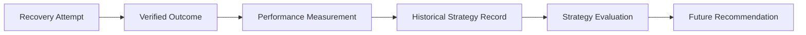

# VORTEX Strategy Learning

VORTEX uses verified historical recovery outcomes to evaluate recovery strategies and inform future strategy recommendations.

**VORTEX learns from outcomes; it does not give AI unrestricted authority over execution.**

## 1. Purpose

Strategy learning exists because:
- Different recovery strategies (e.g., Retry vs. Escalate) perform differently depending on context.
- Historical, verified payment outcomes provide the most reliable evidence for future decisions.
- Measuring performance using actual recovered revenue prevents blind retries from appearing successful.
- Insufficient historical data should trigger safe baselines, preventing overconfident strategy selection.

## 2. Learning Loop

The learning lifecycle is entirely outcome-driven:

## 3. What VORTEX Learns From

VORTEX extracts historical evidence from recorded `RecoveryAction` and `RecoveryCase` entities (managed in `strategy_performance.py`). The learning engine evaluates:

- **Strategy Type**: e.g., `IMMEDIATE_RETRY`, `DELAYED_RETRY`, `ESCALATE_TO_HUMAN`.
- **Event Type**: e.g., `PAYMENT_FAILED`, `INVOICE_OVERDUE`.
- **Attempts**: Number of times the strategy was executed.
- **Successful Recoveries**: Number of times the strategy resulted in a `RECOVERED` case.
- **Recovered Revenue**: Total monetary value recovered by the strategy.
- **Cost**: The predefined intervention cost (e.g., Escalation costs ₹100.00).

*Note: VORTEX uses actual verified database records; it does not hallucinate historical metrics.*

## 4. Strategy Performance

VORTEX calculates strategy performance dynamically (`_calculate_base_stats`). For a given strategy, it computes:

- **Success Rate**: `(Successful Attempts / Total Attempts) * 100`
- **Expected Recovery**: Estimated value before outcome.
- **Total Cost**: Total intervention cost accumulated across all attempts.
- **Net Recovery**: `Total Recovered Revenue - Total Cost`.

The engine weights these metrics (prioritizing Net Recovery and Success Rate) to rank strategies, identifying the historically optimal path.

## 5. Event-Type Segmentation

VORTEX segments strategy performance by `RevenueEventType`. 

A strategy that yields high net recovery for a standard `PAYMENT_FAILED` event might perform poorly for an `INVOICE_OVERDUE` event. By evaluating outcomes within the specific context of the failure event type (`get_strategy_performance_by_event`), the system recommends strategies tailored to the precise nature of the leakage.

## 6. Minimum Historical Evidence

To prevent statistical anomalies from dictating strategy, VORTEX enforces strict minimum-data requirements:

- **Performance Classification**: A minimum of **3 attempts** is required before a strategy is included in general performance rankings.
- **Strategy Recommendation**: A minimum of **5 attempts** (N≥5) is required before historical performance is permitted to influence or override the baseline recommendation for a specific case.

If insufficient data exists, VORTEX relies on the deterministic baseline logic (F11 heuristic).

## 7. Strategy Optimization

The optimizer (`strategy_optimizer.py`) determines the best strategy for a specific case.

1. **Baseline Evaluation**: Calculates base probabilities for all strategies using deterministic heuristics (e.g., risk level, retry count, age).
2. **Historical Injection**: If a strategy has ≥5 historical attempts, its probability and expected net recovery are replaced with the *actual* historical success rate and net recovery.
3. **Guardrail Filter**: Strategies blocked by safety policies (e.g., retry limits exceeded) are disqualified.
4. **Ranking**: The remaining allowed strategies are ranked by Expected Net Recovery, Confidence, and Cost.

VORTEX does **not** employ a machine-learning neural network for this selection; it uses a transparent, explainable statistical optimization engine.

## 8. Verified Outcomes as Evidence

Strategy learning is explicitly based on **verified recovery outcomes**. 

- An **attempted recovery** (e.g., launching Razorpay Checkout) is tracked as an attempt.
- A **verified recovery** (e.g., receiving a `payment.captured` webhook) increments the successful recovery count.
- Failed or abandoned checkouts decrease the strategy's historical success rate.

## 9. Safety Boundary

**Strategy learning influences recommendations, not safety boundaries.**

Historical data may suggest that `IMMEDIATE_RETRY` yields the highest net recovery. However, if the current case has already exhausted its maximum retry limit (e.g., 3 attempts), the deterministic guardrails will `BLOCK` the retry strategy.

Learning cannot:
- Bypass guardrails or cooldown periods.
- Increase retry limits.
- Override closed case states.
- Authorize blocked actions.

*(See [Guardrails & Safety Boundaries](GUARDRAILS.md) for details).*

## 10. Learning vs AI Diagnosis

VORTEX strictly separates probabilistic AI from statistical learning:

- **AI Diagnosis**: Uses a Large Language Model (Gemini) to analyze textual evidence and context (e.g., "Insufficient funds") to provide an advisory explanation.
- **Strategy Learning**: Uses mathematical analytics over actual historical payment outcomes (Success Rates, Net Recovery) to determine the best financial path.

Historical strategy records **do not** autonomously retrain the Gemini AI model. They independently inform the Strategy Optimizer.

## 11. Batch and Historical Evaluation

Evaluators can view aggregated historical learning in the **Strategy Performance** dashboard. This exposes the underlying metrics for all strategies, allowing merchants to see exactly which strategies historically yield the highest success rates and net revenue across batch workloads.

## 12. Example

**Scenario**: A `PAYMENT_FAILED` event occurs. 
- **Learning check**: The system checks historical outcomes for `PAYMENT_FAILED`.
- **Sufficient Data**: `IMMEDIATE_RETRY` has 50 attempts and an 80% success rate, yielding the highest Net Recovery.
- **Recommendation**: The Optimizer recommends `IMMEDIATE_RETRY` based on this evidence.
- **Guardrail Check**: The case has 0 prior attempts. The guardrails authorize the action.

**Low-Data Scenario**: A new failure type occurs with only 2 historical attempts. 
- **Learning check**: Insufficient data (N<5). 
- **Fallback**: The system explicitly logs: *"Insufficient historical data (N<5). Relying on F11 baseline"*, and uses the deterministic heuristic to recommend a safe strategy.

## 13. What This Is Not

To prevent misunderstanding, VORTEX explicitly **does not** claim:
- Autonomous machine-learning model retraining.
- Unrestricted reinforcement learning.
- Guaranteed optimal recovery for every case.
- AI-controlled financial execution.
- Learning that can bypass deterministic safety policies.

## 14. Limitations

- **Data Dependency**: Strategy quality depends entirely on the availability of recorded historical outcomes.
- **Low-Data Reliance**: In early deployments (N<5), the system relies heavily on deterministic fallbacks rather than historical intelligence.
- **Test Mode**: Historical outcomes are generated using Razorpay Test Mode; real-world success rates will vary.
- **Volatile State**: Currently, application state (and therefore learning history) is stored in-memory (`store.py`) and resets upon server restart.

## 15. Related Documentation

- [Recovery Engine](RECOVERY_ENGINE.md)
- [Revenue Evaluation](REVENUE_EVALUATION.md)
- [Guardrails & Safety Boundaries](GUARDRAILS.md)
- [AI Diagnosis Architecture](AI_DIAGNOSIS.md)
- [Architecture Overview](ARCHITECTURE.md)
- [Demo Runbook](DEMO_RUNBOOK.md)
