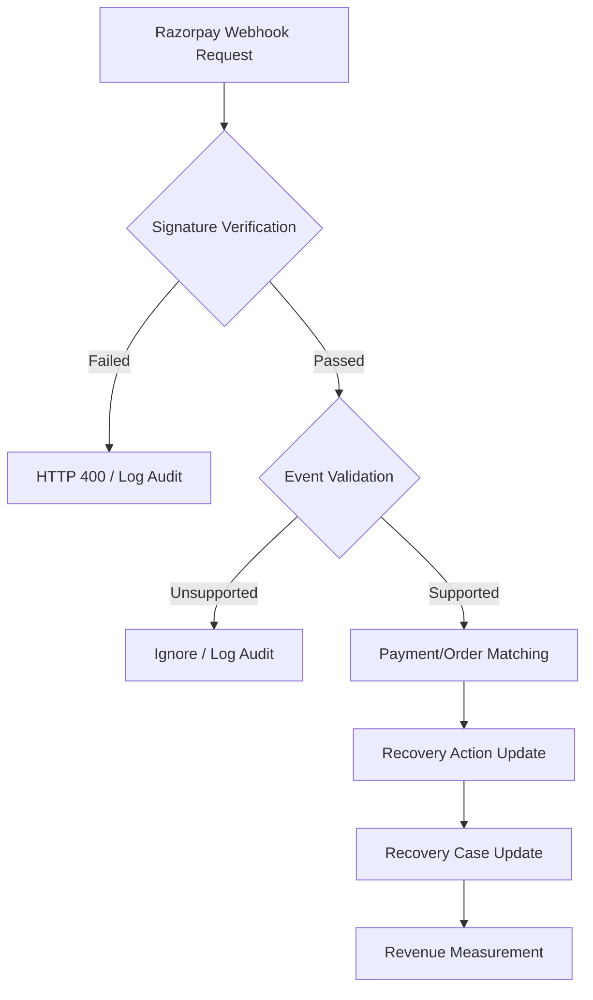

# VORTEX Webhook Verification

Razorpay webhook events provide the external payment evidence used by VORTEX to verify recovery outcomes. 

**A recovery attempt is not counted as recovered until the payment outcome is verified.**

## 1. Purpose

VORTEX relies on Razorpay as the external execution boundary. VORTEX does not treat a checkout initiation or a local order creation as a successful recovery. Instead, asynchronous webhook events provide the definitive cryptographic evidence of a payment outcome. Only successfully validated events are allowed to transition a case to the `RECOVERED` state and update revenue metrics.

## 2. Webhook Flow

## 3. Webhook Endpoint

VORTEX explicitly listens for incoming Razorpay Test Mode webhooks at:

- **Method**: `POST`
- **Path**: `/api/v1/webhooks/razorpay`
- **Purpose**: To securely receive, validate, and process external payment state changes.
- **Payload**: Standard JSON payload delivered by the Razorpay webhook system.

## 4. Supported Razorpay Events

The endpoint actively processes the following Razorpay events:

- **`payment.captured`** (and **`order.paid`**): Represents a successful payment that has been captured by the gateway. VORTEX uses this to confirm the recovery of a specific case and transition the case to `RECOVERED`.
- **`payment.failed`**: Represents a failed payment attempt. VORTEX logs this, increments the retry count, and generates a new revenue-risk event if not already tracked.

Events outside of these are logged as `WEBHOOK_UNHANDLED` and safely ignored without modifying recovery state.

## 5. Signature Verification

VORTEX unconditionally validates the Razorpay webhook signature before parsing the payload.

- **Mechanism**: The backend uses HMAC SHA-256 to compute a signature from the raw request body and the server-side `RAZORPAY_WEBHOOK_SECRET`.
- **Validation**: It securely compares the computed signature against the `x-razorpay-signature` HTTP header using `hmac.compare_digest`.
- **Success**: The webhook payload is permitted to enter the event processing pipeline.
- **Failure**: The system immediately rejects the request with an `HTTP 400 Invalid webhook signature` response and logs a `WEBHOOK_FAILED` audit event.

## 6. Request Validation

Once the signature is verified, VORTEX performs application-level validation:
- Validates that the JSON body is well-formed.
- Validates the `event` type against the supported event list.
- Extracts the `payment.entity.id` and `order_id` to ensure required tracking fields exist.
- Performs duplicate-event checks to ensure idempotency.

## 7. Payment-to-Recovery Mapping

To prevent unrelated payments from artificially marking a case as recovered, VORTEX maps external events strictly to internal recovery objects:

1. The webhook payload provides the `order_id` and `payment_id`.
2. VORTEX looks up the `order_id` in its internal store (`store.razorpay_orders`), which was recorded when the recovery action was first authorized.
3. The internal order record provides the exact `case_id` and `action_id`.
4. VORTEX fetches the specific `RecoveryCase` and `RecoveryAction` associated with that ID.

If the `order_id` is unknown or unrelated to an active recovery case, the event cannot trigger a recovery confirmation.

## 8. Recovery Confirmation

When a `payment.captured` or `order.paid` event is successfully mapped to an active case:

1. The `RecoveryAction` status is finalized to `EXECUTED`.
2. The `RecoveryCase` status is transitioned to `RECOVERED`.
3. The recovered revenue is officially recorded in the operational metrics.

*Opening Checkout or initiating a payment is not recovery; verified payment evidence is explicitly required.*

## 9. Idempotency and Duplicate Events

VORTEX implements explicit duplicate-event protection. 

During ingestion, the system scans existing tracked revenue events. If an event already exists matching both the `razorpay_payment_id` and the specific mapped event type (e.g., `PAYMENT_SUCCESS`), VORTEX detects the duplicate. 

- **Behavior**: The system halts further state updates, returns a `200 OK` (or specific JSON status: `"duplicate"`) to acknowledge receipt to Razorpay, and logs a `WEBHOOK_DUPLICATE` audit event. This strictly prevents double-counting recovered revenue.

## 10. Failure Handling

VORTEX fails safely when encountering invalid webhooks:
- **Invalid Signature**: Returns `HTTP 400` and halts processing.
- **Invalid JSON**: Returns `HTTP 400` (`"Invalid JSON body"`).
- **Unsupported Event**: Returns a JSON object with `status: "ignored"` and halts processing.
- **Malformed Payload**: Missing payment IDs trigger an `HTTP 400` (`"Malformed payload"`).

## 11. Security Boundary

The webhook implementation acts as a strict security boundary:
- The `RAZORPAY_WEBHOOK_SECRET` is kept securely on the server (`app/config.py`).
- The frontend has no ability to bypass webhook verification to force a case into a recovered state.
- AI (Gemini) diagnosis has no authority to validate payment completion.
- External cryptographically signed payment evidence is the sole arbiter of financial outcome.

## 12. Auditability

Webhook activity is fully transparent within the VORTEX audit lifecycle. The system records:
- `WEBHOOK_RECEIVED`: Includes the event name and external `payment_id`.
- `WEBHOOK_FAILED`: Includes the rejection reason (e.g., invalid signature).
- `WEBHOOK_DUPLICATE`: Includes the conflicting payment ID.
- `WEBHOOK_UNHANDLED`: Includes the unsupported event type.
- `CASE_RECOVERED`: The final audit event linking the webhook payment ID to the confirmed recovery.

## 13. Example Verification Flow

1. VORTEX creates a Razorpay recovery order.
2. The customer completes the Test Mode payment.
3. Razorpay asynchronously `POST`s a `payment.captured` webhook to `/api/v1/webhooks/razorpay`.
4. VORTEX validates the HMAC SHA-256 signature against the `x-razorpay-signature` header.
5. VORTEX matches the payload's `order_id` to the internal `RecoveryAction` and `RecoveryCase`.
6. The payment outcome is accepted as verified.
7. The action is marked `EXECUTED` and the case `RECOVERED`.
8. Verified recovered revenue is reflected in the Command Center metrics.

## 14. Test Mode Verification

During Buildathon evaluation, webhook verification is demonstrated entirely using Razorpay Test Mode. When a test payment is completed in the Checkout UI, the local or deployed VORTEX backend receives the Test Mode webhook, validates it, and updates the case state.

## 15. Limitations

- **Test Mode Only**: The integration relies entirely on Razorpay Test Mode credentials and payloads.
- **Configuration Dependent**: Verification strictly requires the `RAZORPAY_WEBHOOK_SECRET` to match the Razorpay dashboard settings.
- **Volatile State**: Currently, application state (cases, actions, orders) is stored in-memory (`store.py`) and resets upon server restart.
- **Delivery Guarantees**: VORTEX processes webhooks securely, but relies on Razorpay's delivery system to push events; network interruptions may delay recovery confirmation unless fallback API polling (`/verify-payment`) is used.

## 16. Related Documentation

- [Razorpay Integration](RAZORPAY_INTEGRATION.md)
- [Guardrails & Safety Boundaries](GUARDRAILS.md)
- [Recovery Engine](RECOVERY_ENGINE.md)
- [Revenue Evaluation](REVENUE_EVALUATION.md)
- [Architecture Overview](ARCHITECTURE.md)
- [Deployment Guide](DEPLOYMENT.md)
- [Demo Runbook](DEMO_RUNBOOK.md)
