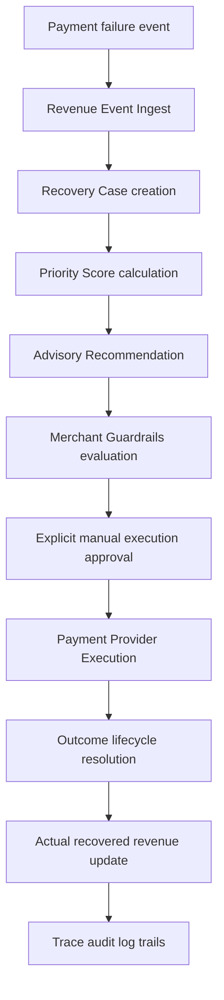

# Production Recovery Controls, Configuration & Readiness Architecture

This document describes the design, safeguards, configuration, and structural architecture implemented in Milestone F10 to prepare the Revenue Sentinel system for core operational production deployment.

---

## 1. End-to-End Recovery Flow

The entire data cycle within the system maps to the following strict timeline steps:



1. **Webhook Ingest**: Webhook failures from payment processors hit the sentinel webhooks entrypoint.
2. **Revenue Event**: An immutable revenue event is recorded, verifying authenticity and checking for duplicate transactions.
3. **Recovery Case**: Active open cases are registered in-memory for failing items.
4. **Priority Score**: Calculates time sensitivity and amount exposure.
5. **Recommendation**: Analyzes past attempts to recommend the safest action.
6. **Guardrails**: Authoritatively blocks any actions violating merchant retry counts, cooldown periods, or global toggles.
7. **Action Confirmation**: The merchant confirms the execution manually.
8. **Provider Retry**: Dispatches to either Mock or Razorpay provider mode.
9. **Outcome Lifecycle**: Resolved statuses (RECOVERED, STOPPED, ESCALATED) lock cases.
10. **Revenue Metrics**: Confirmed recovered funds increment the merchant's actual statistics.
11. **Audit Logs**: Generates chronological audit log traces.

---

## 2. Payment Provider Abstraction

Abstractions decouple execution logic from gateways, implementing:

```
BasePaymentProvider (Interface)
    ↓
MockPaymentProvider (Sandbox/Local Tests)
    ↓
RazorpayPaymentProvider (Live Merchant Integration)
```

- **Mock Mode**: Simulates gateway capture/failure. Default for all unit and local development tests.
- **Razorpay Mode**: Resolves merchant authentication keys from environment variables and structures payload integration.

---

## 3. Environment & Mode Configuration

Mode selection is driven by environment flags with zero silent fallbacks:

- `PAYMENT_PROVIDER_MODE`: Supported values are `mock` and `razorpay` (default `mock`).
- `RAZORPAY_KEY_ID`: Live gateway account credential.
- `RAZORPAY_KEY_SECRET`: Live API secret credential.

> [!IMPORTANT]
> If `PAYMENT_PROVIDER_MODE` is set to `razorpay` but credentials are not configured, execution fails safely and records a `CONFIG_ERROR` failed status in the audit log. The engine never silently falls back to Mock mode in production.

---

## 4. Authoritative Guardrails Control

Guardrails act as the absolute boundary.
- **Maximum Retries**: Configured by merchants (0 to 10). Payment retries are blocked immediately once reached.
- **Cooldown Interval**: Configured by merchants (0 to 720 hours). Ensures a mandatory pause between attempts.
- **Global Toggle**: Allows manual pausing of all Sentinel interventions.

> [!NOTE]
> Recommendations are advisory and never execute recovery actions automatically.
> Guardrails are authoritative and cannot be bypassed.

---

## 5. Security & Ingestion Safeguards

- **Signature Verification**: Validates live SHA-256 HMAC signatures using raw request bodies.
- **Constant-Time Comparison**: Employs `hmac.compare_digest` to prevent timing-based attacks.
- **Credentials Masking**: Secrets are never returned to, stored in, or displayed by the frontend console.

---

## 6. Heuristic vs Actual Metrics

To maintain statistical auditing integrity:
- **Revenue Exposure**: Direct amounts at risk.
- **Recovery Potential**: Heuristic estimate of recovered revenue.
  > "Estimated recoverable revenue is a heuristic estimate, not money actually recovered."
- **Confirmed Recovery**: Increments only upon verified successful gateway captures.
  > "Confirmed revenue from successful recovery execution."

---

## 7. Known Production Limitations
- **In-Memory Store**: Relies on class dictionary storage. Production deployments will require database layers.
- **Razorpay Sandbox Modes**: The live gateway relies on the sandbox setup to verify test cards. Live accounts require actual credentials.
