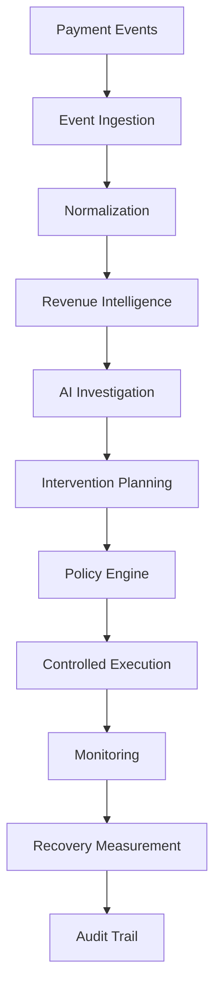

# System Overview - Revenue Sentinel

Revenue Sentinel is an AI-powered revenue recovery platform designed to identify, analyze, and mitigate revenue leakage in payment flows.

## Core Principle

> [!IMPORTANT]
> **AI recommends. Deterministic systems enforce.**
>
> All critical business logic, financial calculations, threshold checks, policy boundaries, and actual execution of interventions are handled by deterministic application code. AI components (like Gemini) are restricted to generating hypotheses, explaining incident roots, and proposing intervention options, but they never bypass policies, modify ledger records, or execute uncontrolled transactions.

---

## Core Pipeline Flow

The platform processes data and manages recovery opportunities through the following stages:

### 1. Payment Events
Raw, real-time transaction webhooks and event feeds emitted from third-party payment processors (e.g. Razorpay).

### 2. Event Ingestion
Reliable endpoint ingestion designed to absorb webhook events idempotently and store raw payload logs.

### 3. Normalization
Translating diverse processor-specific webhook formats into a unified internal schema representing standardized transaction states.

### 4. Revenue Intelligence
Applying deterministic mathematical analysis to compute metrics, determine baseline transaction patterns, and flag statistical anomalies indicating potential revenue leaks.

### 5. AI Investigation
AI models (Gemini) analyze the context of anomalies to generate diagnostic hypotheses, rank potential root causes, and explain incidents to merchants.

### 6. Intervention Planning
Formulating recovery actions (e.g. smart retries, routing modifications, checkout options, or dunning) and calculating associated safety parameters.

### 7. Policy Engine
Validating recommended interventions against strict merchant rules, execution limits, and safety boundaries to ensure compliance.

### 8. Controlled Execution
Executing the authorized recovery plans in a bounded, safe environment utilizing idempotency keys.

### 9. Monitoring
Real-time tracking of intervention execution against predefined stopping conditions (e.g., high failure rates) to trigger automatic rollbacks.

### 10. Recovery Measurement
Quantifying the financial effectiveness of interventions by measuring recovered funds versus baseline expectations.

### 11. Audit Trail
Maintaining a tamper-resistant, chronological log of all ingestion, detection, recommendations, approvals, and executions for compliance and reporting.
